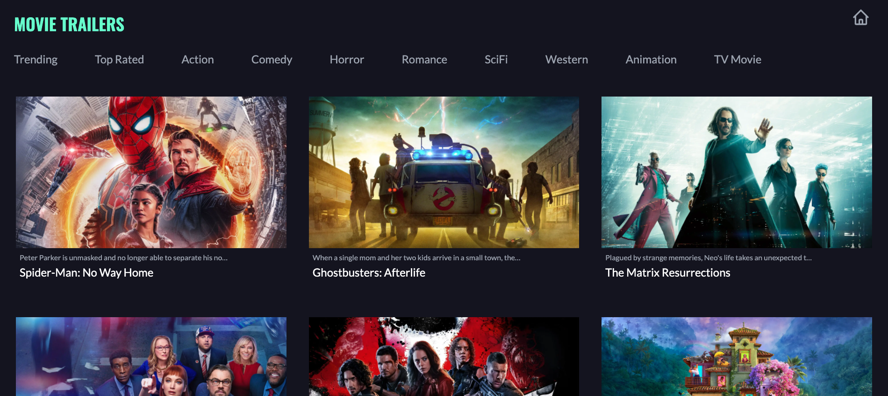

# Movie Trailer Website

Responsive server side rendered website displaying movie trailers sorted by category.
Live demo [_here_](https://moviedb-nextjs-tailwind.vercel.app/)

## Technologies Used

This is a [Next.js](https://nextjs.org/) project bootstrapped with [`create-next-app`](https://github.com/vercel/next.js/tree/canary/packages/create-next-app).

- TailwindCSS
- TMDB API
- Youtube API

## Hosted on

- Vercel

## Features

- Landing page displays sorted movies with details pulled from TMDB API
- dynamic pages with youtube trailers

## Landing Page



## Getting Started

First, run the development server:

```bash
npm run dev
# or
yarn dev
```

Open [http://localhost:3000](http://localhost:3000) with your browser to see the result.

You can start editing the page by modifying `pages/index.js`. The page auto-updates as you edit the file.

[API routes](https://nextjs.org/docs/api-routes/introduction) can be accessed on [http://localhost:3000/api/hello](http://localhost:3000/api/hello). This endpoint can be edited in `pages/api/hello.js`.

The `pages/api` directory is mapped to `/api/*`. Files in this directory are treated as [API routes](https://nextjs.org/docs/api-routes/introduction) instead of React pages.

## Contact

Created by [@cfrancisco726](http://www.carlofrancisco.com) - feel free to contact me!
